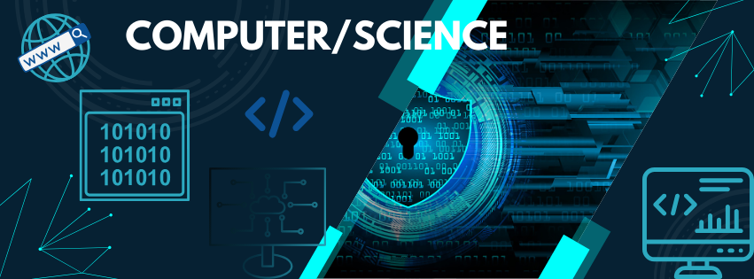

# National 5 Computing Science

<figure markdown="span">
  { width="300" }
  <figcaption></figcaption>
</figure>

Welcome to SQA National 5 Computer Science! This course will introduce you to the exciting world of technology, where you’ll learn how computers work, how to design software, and how to manage data. We’ll cover three main units: **Software Design and Development**, **Computer Systems**, and **Database Design and Development**.

In **Software Design and Development**, you’ll learn how to think like a programmer, creating and testing programs to solve problems. We’ll explore coding basics, developing your skills to write and troubleshoot code effectively.

The **Computer Systems** unit dives into what’s inside a computer and how it works. You’ll learn about hardware, software, and how they work together, along with a look into how data is stored and processed.

Finally, in **Database Design and Development**, you’ll learn how information is organized and stored. You’ll create and manage databases, making it easy to store and access data effectively.

By the end, you’ll have a solid foundation in computer science, ready to explore more advanced topics or pursue a career in tech.
